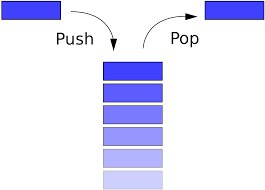

# Redux Bus

### Redux middleware that makes it easy to create buffers with handlers.



[](https://gitter.im/Challenger532/Lobby?utm_source=badge&utm_medium=badge&utm_campaign=pr-badge&utm_content=badge)

[](https://www.npmjs.com/package/redux-bus)
[](LICENSE)
[](https://www.npmjs.com/package/redux-bus)

## [Index](#index)
* [What is Redux Bus?](#what-is-redux-bus)
* [Installation](#installation)
* [Usage](#usage)
  - [Simple Example](#simple-example)
  - [Adding the reducer](#adding-the-reducer)
  - [Adding the middleware](#adding-the-middleware)
  - [Dispatching actions](#dispatching-actions)
* [Presets](#presets)
  - [Network handler](#network-handler)
  - [Undo handler](#undo-handler)
 * [TODO](#todo)
 * [Examples](#examples)
 * [Resources](#resources)
 * [Thanks](#thanks)

## What is Redux Bus
Redux middleware that allows using buffers for undoable actions, and potentially much more.

## Installation

To install the stable version:

```bash
npm i -S redux-bus
```
or
```bash
yarn add redux-bus
```

## Usage

#### Simple example
```js
// bus: 'handler-name command-name'
// all what you have to do is to add this line to have a lot of features..
// many handers with many commans for each one exist..
let action = {
  type: 'INCREMENT_COUNTER', // or use any other type
  bus: 'network save',
}
```


#### Adding the reducer
```js
// include the reducer while creating the store:
import {reducer as bus} from 'redux-bus'
const reducers = combineReducers({
   ...
   ...
   bus,
 })
```
#### Adding the middleware
```js
import {createBus} from 'redux-bus'

const busMiddleware = createBus()

// add the middleware alongside the rest of your middleware
const middlewares = applyMiddleware([..., busMiddleware, ...])
```


#### Dispatching Actions
```js
let action = {
  type: 'INCREMENT_COUNTER',
  bus: 'handler-name command-name'
}

or

let action = {
  type: 'INCREMENT_COUNTER',
  payload:{
    bus: 'handler-name command-name'
  }
}

or

let action = {
  type: 'INCREMENT_COUNTER',
  bus: 'handler-name  command-name  prop1:value1  prop2:value2 ....'// add as many props as you want to pass them to the handler..
}

let action = {
  type: 'INCREMENT_COUNTER',
  bus: 'handler-name  command-name  param1  param2  param3....'// add as many params as you want to pass them to the handler..
}

dispatch(action)
 ```

#### Complete example

```js
/*
  Check the network mode boolen when action is dispatched,
  if mode is online it just pass it, else if mode is offline,
  it saves the action to a buffer instead of dispatching it,
  until mode changed to online, then it dispatch all buffered
  actions.
  when network state changes, mode must be updated.
*/
let action = {
  type: 'INCREMENT_COUNTER', // or use any other type
  bus: 'network save', // or bus: 'network save timeout:60'

  /*
    or
    payload: {
      bus: 'network save',
    },
  */
}
<button
...
onClick={() => dispatch(action)}
...
/>


let action = {
  type: 'ignored_type',
  bus: 'network go-online',
  }
// this is just an example, and it doesn't work on react-native.
window.addEventListener('online',  () => dispatch(action));


let action = {
  type: 'ignored_type',
  bus: 'network go-offline',
  }
window.addEventListener('offline',  () => dispatch(action));
```


## Built-in queues
### Network handler
In this queue, when action dispatched, the handler checks the network mode, if the mode is offline, actions are buffered, else if the mode is online, the action will be forwarded.
when mode changed to online, the handler dispatch the buffered actions, default mode is online.

<pre>
  bus: 'network <b>save</b>'
  bus: 'network <b>go-online</b>'
  bus: 'network <b>go-offline</b>'
  bus: 'network <b>update-all</b>'
  bus: 'network <b>cancel-all</b>'
</pre>

```js
let action = {
  type: 'INCREMENT_COUNTER',
  bus: 'network save' // save the action to the queue if the mode is  `offline`
                      // default mode is online, which means all actions will
                      // be passes until go-offline

  /*
  or
  payload:{
    bus: 'network save'
  }
  */
}
dispatch(action)


let action = {
  type: 'INCREMENT_COUNTER',
  bus: 'network go-online', // change mode to online, dispatch all saved actions
                            // that are not timed-out
}


let action = {
  type: 'INCREMENT_COUNTER',
  payload: {
    bus: 'network go-offline' // change mode to offline, start saving actions in queue
                              // with default timeout= 5 min
  }
}

let action = {
  type: 'INCREMENT_COUNTER',
  bus: 'network cancel-all' // clear all actoins saved in buffer
}

let action = {
  type: 'INCREMENT_COUNTER',
  bus: 'network update-all' // clear all timed-out actions saved in buffer,
                            // dispatach all actions that are not timed-out
}


```


### Undo handler
This queue can be used for undoing actions, actions can be canceled before dispatched, and many other potentials..

<pre>
bus: 'undo <b>push</b>',
bus: 'undo <b>unshift</b>',

bus: 'undo <b>pop</b>',
bus: 'undo <b>pop-undo</b>',

bus: 'undo <b>shift</b>',
bus: 'undo <b>shift-undo</b>',

bus: 'undo <b>do-all</b>',
bus: 'undo <b>cancel-all</b>',
</pre>

```js
let action = {
  type: 'INCREMENT_COUNTER',
  bus: 'undo PUSH', // PUSH a new action (ignore or undo the current one if exist)
}


let action = {
  type: 'INCREMENT_COUNTER',
  bus: 'undo UNDO',
}


let action = {
  type: 'INCREMENT_COUNTER',
  bus: 'undo DO', // DO the last buffered action, re-dispatch it.
}

let action = {
  type: 'INCREMENT_COUNTER',
  bus: 'undo DO_PUSH',// DO the last buffered action and PUSH new one
}

let action = {
  type: 'INCREMENT_COUNTER',
  payload: {
    // @NOTE: bus can be a child of an payload
    bus: 'undo DO'
  }
}
```


### TODO
- [x] create pre defined handler for saving offline dispatched actions
- [ ] create pre defined handler for delaying actions for specific period
- [ ] add some docs about usage with redux-ack
- [x] add tests

### Examples

* [Undo handler](https://github.com/challenger532/redux-bus/blob/master/src/presets/undo/index.js) ([source](https://github.com/challenger532/redux-bus/blob/master/src/presets/undo/index.js))
* [Network handler](https://github.com/challenger532/redux-bus/blob/master/src/presets/network/index.js) ([source](https://github.com/challenger532/redux-bus/blob/master/src/presets/network/index.js))


### Resources
- http://redux.js.org/docs/advanced/Middleware.html
- https://medium.com/@meagle/understanding-87566abcfb7a
- https://github.com/gaearon/redux-thunk

### Thanks

* [James](https://github.com/aretecode) for the great support

